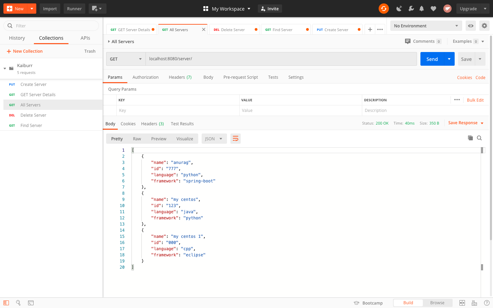
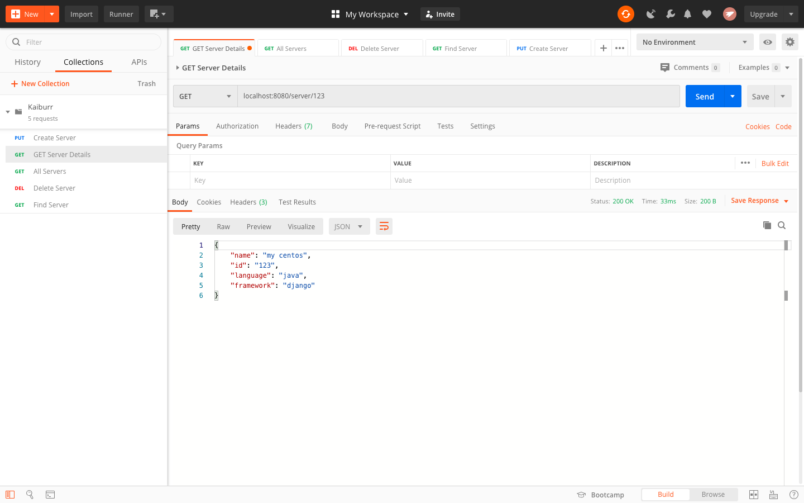
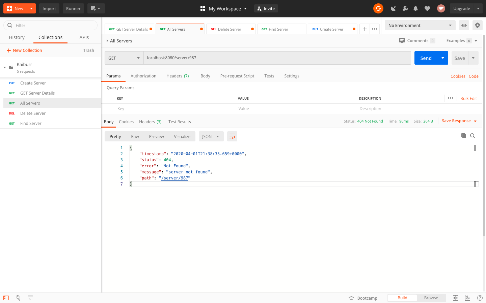
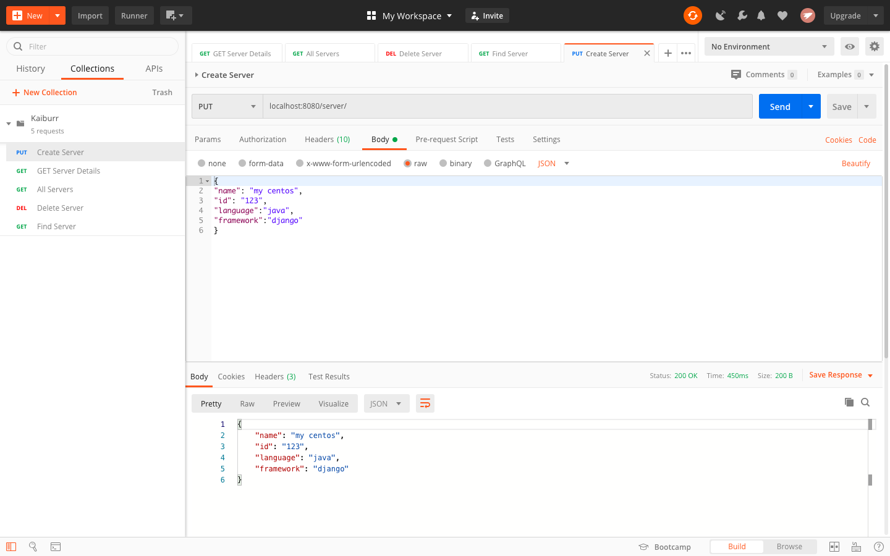
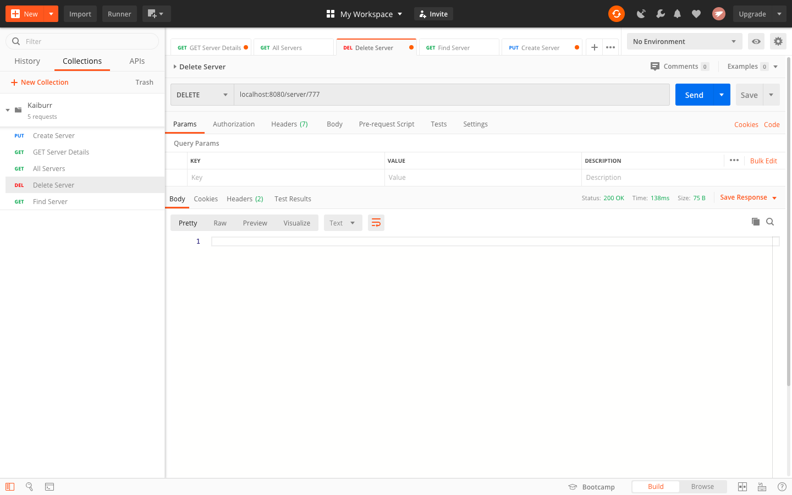
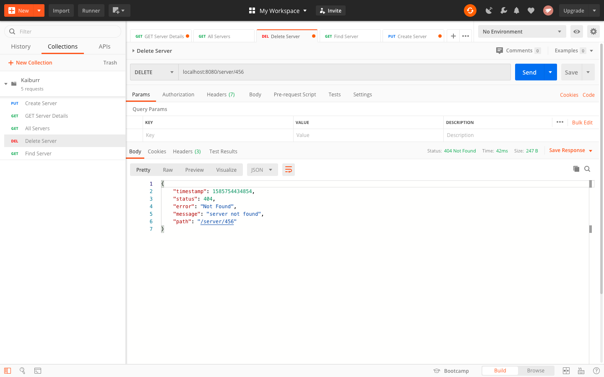
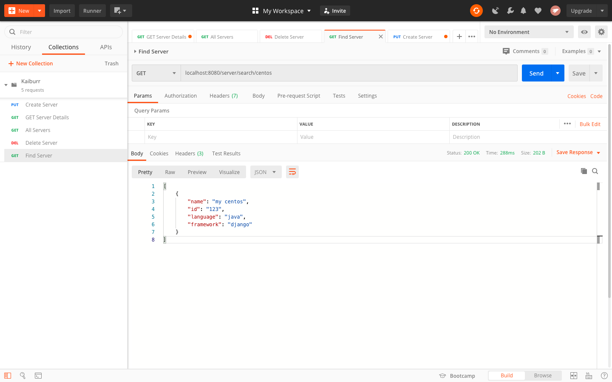
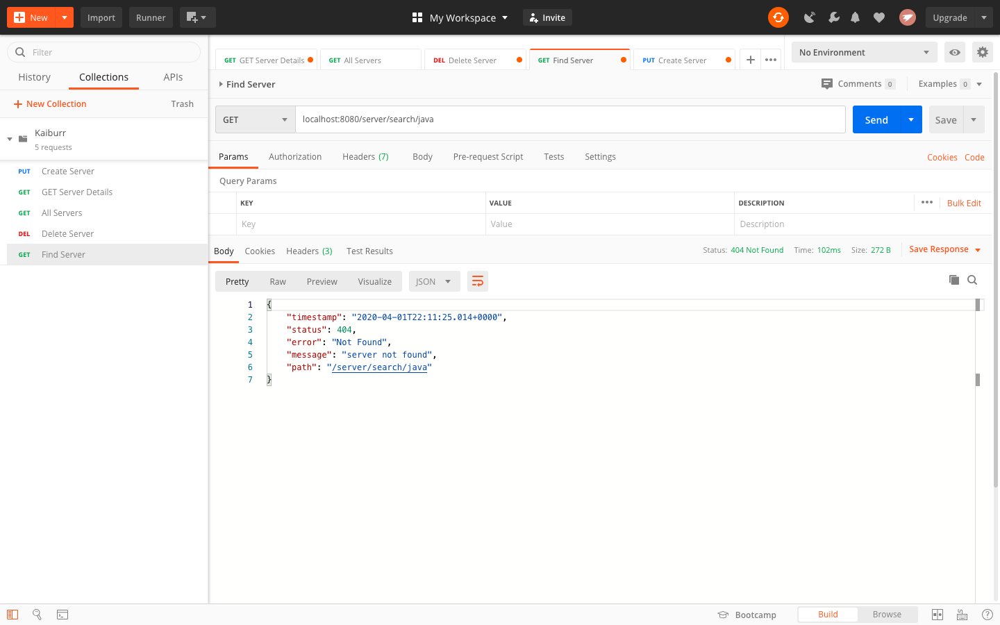

Task 1. Java REST API example.

# Kaiburr Server REST API

Implement an application in java which provides a REST API with endpoints for searching, creating and deleting “server” objects

Created the REST API application using Spring Boot - Maven while at the same time mantaining code modularization and testing exposed endpoints using Postman .

Task 1 Sceenshots :

1. GET servers - Return all the servers if no parameters are passed. 
	
	
2. GET servers - When server id is passed as a parameter - return a single server.
	
	
	Return 404 if there’s no such a server.
	
	
3. PUT a server - The server object is passed as a json-encoded message body.
	
	
4. DELETE a server - The parameter is a server ID.
	
	
	
	
5. GET (find) servers by name. The parameter is a string. Must check if a server name contains this string and return one or more servers found.
	
	
	Return 404 if nothing is found.
	
