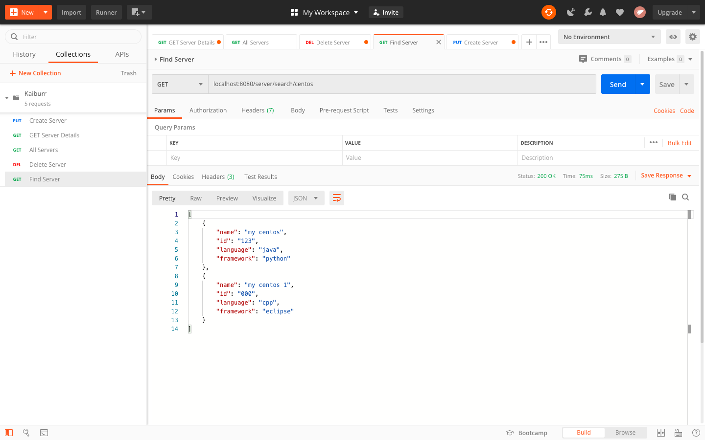

## Task 1. Java REST API example.

# Kaiburr Server REST API

Implement an application in java which provides a REST API with endpoints for searching, creating and deleting “server” objects.

Created the REST API application using Spring Boot - Maven while at the same time mantaining code modularization and testing exposed endpoints using Postman .

Postman Collection Link : https://drive.google.com/open?id=1xQtKQ5oYdiyMB7dSZ644Y-t3AY_nfxla

Task 1 Sceenshots :

1. GET servers - Return all the servers if no parameters are passed. 
	
	
2. GET servers - When server id is passed as a parameter - return a single server.
	
	
	Return 404 if there’s no such a server.
	
	
3. PUT a server - The server object is passed as a json-encoded message body.
	
	
4. DELETE a server - The parameter is a server ID.
	
	
	
	
5. GET (find) servers by name. The parameter is a string. Must check if a server name contains this string and return one or more servers found.
	
	
	Return 404 if nothing is found.
	
	
6. Data in MongoDB database.
	
	

	

## Task 2. Swagger codegen.

# Kaiburr Swagger Integration

In this task I have integrated my Kaiburr Server REST API with swagger because I didn't require Codegen Stub for the REST APIs.

Swagger is an open-source software framework backed by a large ecosystem of tools that helps developers design, build, document, and consume RESTful web services.

Task 2 Screenshots :

	
        

	

## Task 3. Docker compose.

# Kaiburr Docker Compose

Docker is a platform for developers and sysadmins to build, run, and share applications with containers. The use of containers to deploy applications is called containerization. Containers are not new, but their use for easily deploying applications is.

### Define a container with Dockerfile :

Take a look at the file called Dockerfile in the application. Dockerfiles describe how to assemble a private filesystem for a container, and can also contain some metadata describing how to run a container based on this image.

### Build and test the image :

Make sure you’re in the directory `anurag_kaiburr/` in a terminal or PowerShell using the `cd` command. Let’s build the kaiburr-server image:

	docker build --tag kaiburr-server:latest .
	

### Run the image as a container :

	docker run -p 8000:8080 -d kaiburr-server:latest
	
	
### Overview of Docker Compose :

Compose is a tool for defining and running multi-container Docker applications. With Compose, we use a YAML file to configure our application’s services. Then, with a single command, we create and start all the services from our configuration.

Using Compose is basically a three-step process:

1. Define the app’s environment with a `Dockerfile` so it can be reproduced anywhere.

2. Define the services that make up our app in `docker-compose.yml` so they can be run together in an isolated environment.

3. Run `docker-compose up` and Compose starts and runs our entire app.

Task 3 Screenshots :

	docker-compose up

	docker-compose down

## Deployment of Web Application

1. To run on localhost :

`spring.data.mongodb.host=localhost` in `src -> main -> resources -> application.properties` file.

2. For Docker Compose :

`spring.data.mongodb.host=kaiburr-mongodb` in `src -> main -> resources -> application.properties` file.
